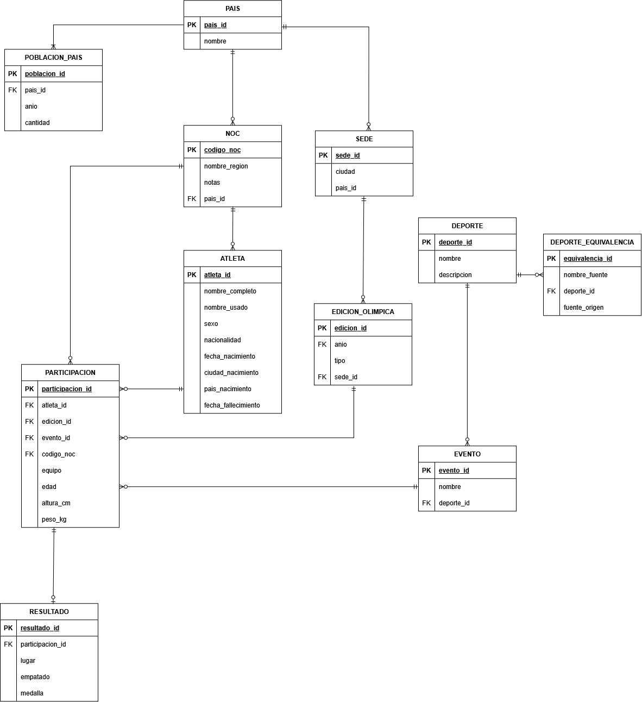
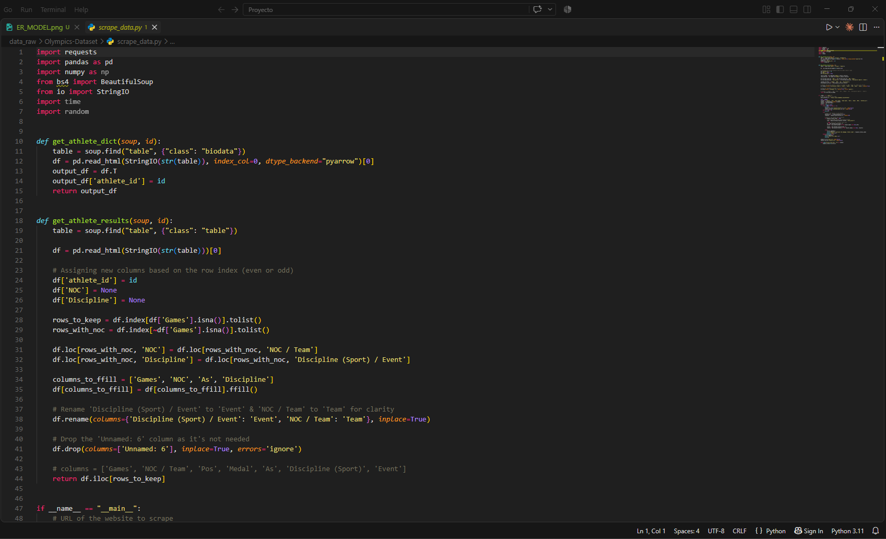
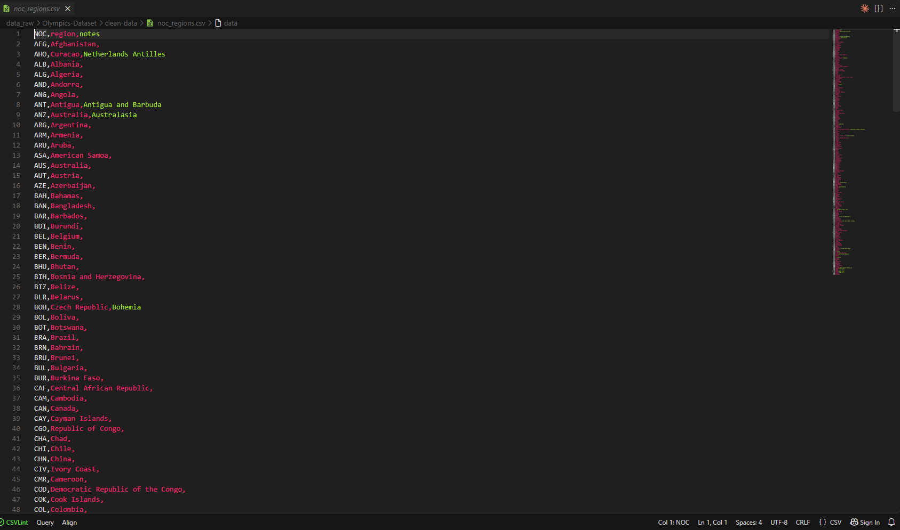
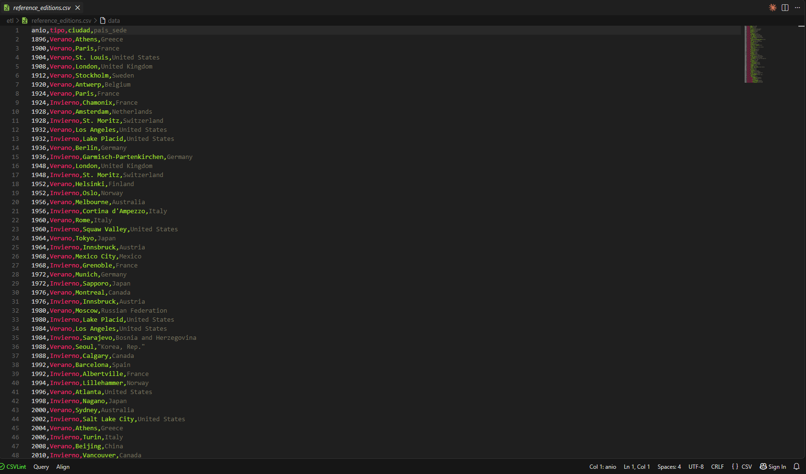

# Informe del proyecto: base de datos integrada de Juegos Olímpicos

Sistemas de Bases de Datos 2, Universidad de San Carlos de Guatemala.

## Integrantes: grupo 4

- 202307775: Javier Andrés Velásquez Bonilla
- 202203805: Kimberly Alejandra Miranda Macario 
- 202308940: Katheryn Gabriela Tziná Paz


> Documento único que reúne el modelo de datos, las fuentes utilizadas,
> el proceso de extracción y carga, las decisiones tomadas durante la
> integración, el estado final de la base y el diseño de los stored
> procedures pedidos por el enunciado. Los documentos originales de
> donde se extrajo este contenido (`DECISIONES.md`, `FUENTES.md`,
> `modelo_er_proyecto1.md`, `etl/REPORTE.md`,
> `sintesis_datasets_olimpiadas.md`) se conservan sin borrar en
> `backup_docs/` como registro histórico detallado.

## Índice

1. [Introducción y objetivo del proyecto](#1-introducción-y-objetivo-del-proyecto)
2. [Modelo de datos](#2-modelo-de-datos)
3. [Fuentes de datos](#3-fuentes-de-datos)
4. [Proceso de extracción y carga (ETL)](#4-proceso-de-extracción-y-carga-etl)
5. [Hallazgos y decisiones durante la integración](#5-hallazgos-y-decisiones-durante-la-integración)
6. [Estado final de la base de datos](#6-estado-final-de-la-base-de-datos)
7. [Stored procedures (incisos d y e)](#7-stored-procedures-incisos-d-y-e)
8. [Limitaciones conocidas](#8-limitaciones-conocidas)
9. [Uso de herramientas de inteligencia artificial en el desarrollo del proyecto](#9-uso-de-herramientas-de-inteligencia-artificial-en-el-desarrollo-del-proyecto)
10. [Puntos a confirmar con el profesor](#10-puntos-a-confirmar-con-el-profesor)

---

## 1. Introducción y objetivo del proyecto

El proyecto consiste en construir una base de datos relacional propia
que integre datos históricos de los Juegos Olímpicos provenientes de
varias fuentes públicas, siguiendo un modelo entidad-relación acordado
por el equipo, no el esquema de ninguna fuente en particular. El
enunciado pide cuatro fuentes de datos concretas (ver sección 3),
todas las llaves primarias del modelo son generadas por el propio
esquema (no se reutiliza ningún identificador de las fuentes externas
como llave), y el trabajo se organiza en tres capas: un script SQL que
define el esquema (`sql/ddl.sql`), un proceso de extracción, limpieza
y carga (ETL, `etl/etl.py`) que puebla esa base desde los archivos de
origen, y un conjunto de stored procedures (`sql/procedures.sql`) que
resuelven las consultas pedidas en los incisos d) y e) del enunciado.

Motor de base de datos: PostgreSQL 16, corriendo en un contenedor
Docker (`olimpiadas_pg`, puerto `55433`), esquema `olimpiadas`.

### Cumplimiento del enunciado

| Inciso | Descripción | Sección de este informe |
|---|---|---|
| a | Modelo de datos / diagrama entidad-relación | 2 |
| b | Extracción y carga de datos (ETL) | 4 |
| c | Scripts SQL (tablas, llaves, índices, carga) | 2, 4; scripts originales en `sql/` y `backup_docs/` |
| d | Stored procedure de información por atleta | 7 |
| e | Stored procedure de información por país | 7 |

---

## 2. Modelo de datos

El modelo tiene 11 entidades. Todas las llaves primarias son
`SERIAL`/`BIGSERIAL` generadas por la base, no identificadores tomados
de las fuentes externas (`athlete_id`, código ISO de país, etc.); el
ETL mantiene internamente el mapeo entre el identificador de cada
fuente y la llave surrogate correspondiente.

**Historial del diagrama y resolución de la discrepancia anterior.**
Existen dos versiones del diagrama entidad-relación:

- `images/ER_MODEL_v1.png`: la primera versión, entregada en la
  primera entrega del proyecto (2026-09-02). Tiene 10 entidades y no
  incluye `DEPORTE_EQUIVALENCIA`, porque esa tabla todavía no existía
  en esa fecha. Se conserva como referencia histórica, no como el
  modelo vigente.
- `images/Modelo_ER_v2.png`: el diagrama actualizado y completo, con
  las 11 entidades del esquema final (incluida `DEPORTE_EQUIVALENCIA`,
  conectada 1:N a `DEPORTE`). Es el diagrama que corresponde al DDL
  vigente descrito en esta sección y coincide exacto con
  `sql/ddl.sql`.



La discrepancia señalada en una versión anterior de este informe (el
diagrama no incluía `DEPORTE_EQUIVALENCIA`) queda resuelta con
`Modelo_ER_v2.png`: ya no hay diferencia entre el diagrama y el
esquema real.

```
PAIS(pais_id PK, nombre)

POBLACION_PAIS(poblacion_id PK, pais_id FK->PAIS, anio, cantidad)

NOC(codigo_noc PK, nombre_region, notas, pais_id FK->PAIS NULLABLE)

SEDE(sede_id PK, ciudad, pais_id FK->PAIS)

ATLETA(atleta_id PK, nombre_completo, nombre_usado, sexo, nacionalidad,
       fecha_nacimiento, ciudad_nacimiento, pais_nacimiento, fecha_fallecimiento)

EDICION_OLIMPICA(edicion_id PK, anio, tipo, sede_id FK->SEDE)

DEPORTE(deporte_id PK, nombre, descripcion)

DEPORTE_EQUIVALENCIA(equivalencia_id PK, nombre_fuente, deporte_id FK->DEPORTE,
                      fuente_origen)

EVENTO(evento_id PK, nombre, deporte_id FK->DEPORTE)

PARTICIPACION(participacion_id PK, atleta_id FK->ATLETA, edicion_id FK->EDICION_OLIMPICA,
              evento_id FK->EVENTO, codigo_noc FK->NOC, equipo, edad, altura_cm, peso_kg)

RESULTADO(resultado_id PK, participacion_id FK->PARTICIPACION, lugar, empatado, medalla)
```

### Relaciones y decisiones de diseño integradas

**PAIS es el ancla del modelo.** De él dependen `POBLACION_PAIS`
(población histórica por año), `NOC` (un país puede tener uno o más
comités olímpicos a lo largo de su historia) y `SEDE` (las ciudades
sede pertenecen a un país).

**No existe una llave foránea directa de NOC hacia ATLETA, a
propósito.** El vínculo entre un atleta y el comité con el que
compitió vive únicamente en `PARTICIPACION.codigo_noc`, porque un
mismo atleta puede competir bajo distintos NOC a lo largo de su
carrera (reunificación alemana, disolución de la URSS, cambios de
nacionalidad deportiva). Esto no es solo un argumento teórico: se
verificó contra los datos reales de fuente 1 que 1,834 atletas
cargados compitieron bajo más de un `codigo_noc` distinto, y el patrón
se confirma cualitativamente contra fuente 2 (1,570 atletas
multi-NOC, numeración propia, cobertura solo hasta 2016). La
alternativa de agregar un NOC "principal" a `ATLETA` se descartó
porque perdería ese historial real y sería una elección arbitraria.
Ver el detalle completo, incluida la corrupción del campo
`bios.csv.NOC` que habría sido un intento fallido de resolver esta
misma ambigüedad en la fuente, en la sección 5 (tema NOC).

**NOC.pais_id es nullable.** Hay códigos NOC (equipos históricos o
mixtos, refugiados, atletas individuales neutrales, entidades
disueltas) que no corresponden a un país actual reconocible en el
catálogo `PAIS`, o que se excluyen deliberadamente de esa atribución
(ver el caso de `URS`/`EUN` en la sección 5).

**SEDE se conecta a EDICION_OLIMPICA por `sede_id`.** Está poblada con
ciudad real (columna `City`) para 52 de las 55 ediciones adultas más
las 6 ediciones YOG con `City` real de referencia manual; solo 3
ediciones adultas (2018 Invierno, 2020 Verano, 2022 Invierno) siguen
tomando ciudad/país de una fuente armada a mano porque ninguna fuente
real trae `City` para esos años. Es un reemplazo parcial, no total. El
detalle completo, incluido el caso real de los eventos ecuestres de
1956 disputados en Estocolmo por cuarentena animal, está en la sección
5 (tema sedes y ediciones).

**EDICION_OLIMPICA distingue `tipo`** con cuatro valores posibles:
`Verano`, `Invierno`, `Verano-YOG` e `Invierno-YOG`. Hasta el
2026-09-18 el modelo solo contemplaba Verano/Invierno y las ediciones
de los Juegos Olímpicos de la Juventud (YOG) se excluían por completo
de la carga; el equipo decidió esa fecha ampliar el catálogo para
incluirlas sin mezclarlas con los Juegos adultos (ver sección 5, tema
YOG, y sección 10).

**DEPORTE_EQUIVALENCIA** es una tabla de traducción N:1, agregada el
2026-09-18, para nombres de deporte de una fuente secundaria que no
calzan textualmente con el catálogo canónico de fuente 1 por
diferencia de granularidad o de redacción (`Equestrian` de fuente 3
agrupa lo que fuente 1 separa en 5 disciplinas; `Trampoline
Gymnastics` es el mismo deporte que fuente 1 llama `Trampolining
(Gymnastics)`). Antes de crear una fila nueva en `DEPORTE` para un
nombre de una fuente secundaria, el ETL consulta primero esta tabla de
equivalencias y reutiliza el `deporte_id` canónico si hay coincidencia
registrada. Ver sección 5, tema de nomenclatura de deporte/evento, y
sección 10.

**DEPORTE agrupa varios EVENTO.** Fuente 1 y fuente 3 nombran los
mismos deportes y eventos con convenciones de texto distintas (por
ejemplo `"Javelin Throw, Men (Olympic)"` contra `"Men's Javelin
Throw"`). Una auditoría sistemática encontró que el desajuste no se
limitaba a los 2 casos de deporte ya conocidos, sino que afectaba a
decenas de eventos comunes de atletismo, natación, remo, ciclismo,
gimnasia y esgrima; se implementó una canonicalización que reutiliza
el `evento_id`/`deporte_id` existente cuando la forma normalizada
calza exacto. Aun así, 199 eventos de 2024 quedan como filas nuevas
(mezcla de eventos genuinamente nuevos y variantes de redacción no
resueltas). Ver sección 5.

**PARTICIPACION es la entidad puente central**: conecta `ATLETA`,
`EDICION_OLIMPICA`, `EVENTO` y `NOC`, y guarda los atributos que varían
por participación (equipo, edad, altura, peso). `RESULTADO` separa el
resultado o medalla de la participación, permitiendo múltiples
resultados o desempates (campo `empatado`). Esta cardinalidad 1:N no
es solo una posibilidad teórica del modelo: la carga real de fuente 1
la ejercita con 428 participaciones (caso Polo 1900 como ejemplo
documentado) que tienen más de un resultado, hasta 12 resultados para
una misma participación. Ver sección 5.

---

## 3. Fuentes de datos

El enunciado identifica cuatro fuentes. La estrategia final de carga
fue: fuente 1 como columna vertebral completa (1896-2022), fuente 2
usada solo para derivar sedes reales y como validación cruzada (nunca
se cargan sus participaciones), fuente 3 cargada únicamente para la
edición 2024 (la única que fuente 1 no cubre), y fuente 4 descartada
por completo.

| # | Fuente | Origen real | Cobertura | Uso final |
|---|---|---|---|---|
| 1 | GitHub, KeithGalli/Olympics-Dataset | Scraping de olympedia.org | Verano e invierno, 1896-2022 | Columna vertebral de toda la carga |
| 2 | Kaggle, "120 years of Olympic history" (heesoo37) | sports-reference.com | Moderna, 1896-2016 | Solo para derivar `SEDE`/`EDICION_OLIMPICA` reales y cross-check, nunca participaciones |
| 3 | Kaggle, "Summer Olympics medals 1896-2024" (stefanydeoliveira) | Fusión histórico + París 2024 | Solo Verano, 1896-2024 | Solo el subconjunto `Year==2024` |
| 4 | DataCamp, "r-olympics" (datalab) | Mismo linaje que fuente 2 (sports-reference.com) | Moderna hasta Río 2016 | Descartada, no se carga nada |

Las fuentes 2 y 4 comparten el mismo origen (sports-reference.com),
no son independientes entre sí; en la práctica hay tres conjuntos de
datos distintos: Olympedia (fuente 1, el más completo en variables
auxiliares como geografía y población), sports-reference (fuentes 2 y
4, mismo contenido en dos empaques distintos) y la fusión histórica
más París 2024 (fuente 3, la única que llega hasta 2024).

### Fuente 1: GitHub, KeithGalli/Olympics-Dataset

Datos scrapeados de olympedia.org. Licencia **MIT** (Copyright 2024
Keith Galli), verificada leyendo el archivo `LICENSE` del repositorio
clonado localmente. Obligación: conservar el aviso de copyright y el
texto de la licencia; sin restricción de uso comercial ni obligación
de compartir bajo la misma licencia. Cargada por completo, columna
vertebral 1896-2022.



La captura anterior muestra el script `scrape_data.py` del propio
repositorio de fuente 1 (`data_raw/Olympics-Dataset/`), que ilustra el
origen real de los datos descrito arriba: se obtienen scrapeando
olympedia.org, no de un archivo curado a mano.

`noc_regions.csv` (fuente 1, dentro de `clean-data/`) es el catálogo
base de códigos NOC, comparado columna por columna contra el mismo
archivo de fuente 2 (ver sección 5, tema NOC: son idénticos, 230/230
códigos):



Texto de atribución a usar en el entregable final:

> Datos de atletas y resultados olímpicos (1896-2022) obtenidos de
> Keith Galli, *Olympics-Dataset* (GitHub), a su vez recolectados de
> [olympedia.org](https://www.olympedia.org/). Distribuido bajo
> licencia MIT.

### Fuente 2: Kaggle, "120 years of Olympic history" (heesoo37)

Origen real: sports-reference.com, cobertura moderna hasta Río 2016.
Licencia **CC0: Public Domain**, verificada extrayendo el bloque de
metadatos de la página real de Kaggle (`licenseUrl:
https://creativecommons.org/publicdomain/zero/1.0/`). Sin obligación
legal; se recomienda como buena práctica atribuir el origen real
aunque no sea exigible. Se usa para dos cosas, ninguna es carga
directa de `PARTICIPACION`: derivar `SEDE`/`EDICION_OLIMPICA` reales
(columna `City`, 1896-2016) y cross-check de fuente 1 (confirma el
patrón multi-NOC y compara altura/peso de atletas coincidentes por
nombre). Su `noc_regions.csv` se comparó columna por columna contra el
de fuente 1: son idénticos (230/230 códigos, mismos nombres de región).

Texto de atribución:

> Dataset "120 years of Olympic history: athletes and results"
> (Kaggle, usuario heesoo37), datos originales de sports-reference.com.
> Publicado bajo CC0 (dominio público).

### Fuente 3: Kaggle, "Summer Olympics medals 1896-2024" (stefanydeoliveira)

Origen real: fusión de datos históricos con resultados de París 2024.
Licencia **CC BY-NC-SA 4.0**, verificada extrayendo el bloque de
metadatos de la página real de Kaggle. Las tres letras importan:
**BY** (atribución obligatoria), **NC** (prohibido el uso comercial de
los datos o de cualquier obra derivada) y **SA** (cualquier obra
derivada que incorpore estos datos debe compartirse bajo la misma
licencia). Implicación directa para este proyecto: como se cargaron
filas de esta fuente, el entregable final debe licenciarse también
como CC BY-NC-SA 4.0 y no puede ofrecerse con fines comerciales.

Se confirmó que el archivo trae todas las participaciones, no solo
medallistas (86% de las filas de 2024 tienen `Medal='No medal'`), lo
que corrige una suposición sin confirmar del enunciado original. Se
cargó exclusivamente el subconjunto `Year==2024` (14,892 filas), la
única edición que fuente 1 no cubre; el resto del archivo (1896-2020)
se descarta explícitamente para no duplicar `PARTICIPACION` y, sobre
todo, para minimizar cuánto del dataset final queda bajo esta licencia
más restrictiva que la de fuente 2. No se usa para cross-check general
por el mismo motivo de licencia.

Texto de atribución exacto (obligatorio por la cláusula BY, no
opcional):

> Contiene datos de "Summer Olympics Medals (1896-2024)" por
> stefanydeoliveira (Kaggle), con licencia
> [CC BY-NC-SA 4.0](https://creativecommons.org/licenses/by-nc-sa/4.0/).
> Este trabajo derivado se distribuye bajo la misma licencia
> (CC BY-NC-SA 4.0) y no está autorizado para uso comercial.

### Fuente 4: DataCamp, "r-olympics" (datalab)

Según el enunciado, mismo linaje que la fuente 2 (sports-reference.com)
hasta Río 2016. Licencia **no verificada**: la plataforma de DataCamp
devolvió HTTP 403 al intentar acceder sin sesión autenticada, así que
no se pudo confirmar el texto de licencia real. Se trata como
equivalente a la fuente 2 por instrucción del proyecto, pero esa
equivalencia tampoco está verificada de forma independiente, porque no
se tuvo acceso a los archivos de ninguna de las dos plataformas en
este entorno. No se carga ningún dato de esta fuente; si en el futuro
se obtiene acceso, corresponde verificar tanto el contenido como la
licencia antes de usarla.

### Fuente manual: catálogo de sedes olímpicas (`etl/reference_editions.csv`)

Ninguna de las 4 fuentes oficiales trae una tabla de sede o ciudad
anfitriona por edición. Esta fuente **no es ninguna de las 4 del
enunciado** y se declara aquí explícitamente, como exige la política
del proyecto para cualquier dato externo no oficial.



Se creó a mano un catálogo de 53 filas (año, tipo, ciudad, país sede)
a partir de conocimiento histórico público de las sedes olímpicas
1896-2022, para poder poblar `SEDE` y `EDICION_OLIMPICA` desde el
principio. Ese catálogo dejó de ser la fuente primaria en cuanto se
integraron columnas `City` reales de fuente 2 y fuente 3 (ver sección
5), y hoy solo se sigue usando para 3 ediciones adultas residuales
donde ninguna fuente real trae `City`.

El 2026-09-18, al decidir incluir los Juegos Olímpicos de la Juventud
(YOG) en la carga, se agregaron a mano 6 filas más con las sedes YOG
de dominio público: Singapur 2010, Innsbruck 2012, Nanjing 2014,
Lillehammer 2016, Buenos Aires 2018 y Lausana 2020. Es la misma clase
de dato que el resto de este archivo (conocimiento histórico público,
sin licencia de terceros ni obligación de atribución) y se agregó por
el mismo motivo: ninguna fuente real trae ciudad anfitriona de
ediciones YOG.

### Los 6 códigos NOC agregados manualmente en el ETL

`noc_regions.csv` (230 filas, idéntico en fuente 1 y fuente 2) no
incluye 6 códigos que sí aparecen como valor real de NOC en
`results.csv` (fuente 1) y `olympics_dataset.csv` (fuente 3), porque
son posteriores a la publicación de ese archivo o son designaciones
especiales. Se agregaron a mano en el ETL, verificados fila por fila
contra el archivo real:

| Código | Nombre asignado | Origen exacto | Participaciones |
|---|---|---|---:|
| `LBN` | Lebanon | `results.csv`, alias moderno de `LIB` (que tiene 0 participaciones reales) | 377 |
| `SGP` | Singapore | `results.csv`, alias moderno de `SIN` (0 participaciones reales) | 397 |
| `ROC` | Russian Olympic Committee | `results.csv`, equipo bajo sanción de la AMA/COI en Tokio 2020 | 1,128 |
| `EOR` | Refugee Olympic Team | `results.csv`, acrónimo francés del equipo de refugiados | 47 |
| `COR` | Corea unificada | `results.csv`, equipo conjunto de las dos Coreas, PyeongChang 2018 | 26 |
| `AIN` | Individual Neutral Athletes | `olympics_dataset.csv` (fuente 3), atletas rusos/bielorrusos neutrales, París 2024 | 46 |

Los primeros 5 se agregaron con la carga inicial de fuente 1; `AIN` se
agregó al integrar fuente 3.

---

## 4. Proceso de extracción y carga (ETL)

### Metodología y orden de carga

El pipeline completo, en orden, es: `sql/ddl.sql` (crea el esquema)
seguido de `etl/etl.py --dsn "postgresql://..."` (carga todos los
datos desde los CSV locales en `data_raw/`) seguido de
`sql/procedures.sql` (crea las funciones y procedures de los incisos
d/e). El ETL trabaja completamente sobre `data_raw/`, ya descargado
localmente; no requiere credenciales de Kaggle salvo para renovar esos
archivos desde cero.

Advertencia operativa importante: desde el 2026-09-18,
`sql/ddl.sql` empieza con `DROP SCHEMA IF EXISTS olimpiadas CASCADE;`
antes de recrear el esquema. Es un cambio deliberado (antes era
`CREATE SCHEMA IF NOT EXISTS`) para que el script sea re-ejecutable de
forma limpia durante el desarrollo, pero significa que correrlo contra
una base con datos que se quieran conservar los destruye sin pedir
confirmación. Antes de correr `ddl.sql` contra la base compartida del
proyecto hay que sacar un respaldo con `pg_dump` (ver sección 6).

Orden de carga dentro del ETL:

1. **Fuente 1** se carga primero y por completo: países, población
   histórica, catálogo NOC base, atletas (bios), sedes/ediciones
   iniciales (antes del reemplazo por `City` real), deportes, eventos,
   participaciones y resultados desde `results.csv`.
2. **Fuente 2** se usa únicamente para reemplazar `SEDE`/
   `EDICION_OLIMPICA` por ciudad real (1896-2016) y para cross-check
   de fuente 1 (nunca se cargan sus participaciones).
3. **Fuente 3** se filtra a `Year==2024` y se integra como extensión:
   nuevos atletas (emparejados contra el catálogo ya cargado cuando
   corresponde), nuevos deportes/eventos (o reutilización vía
   canonicalización/`deporte_equivalencia`), y sus 14,892 participaciones
   y resultados de París 2024.

### Reconciliación exacta de `results.csv`

Calculada por la corrida real contra Postgres 16 del 2026-09-18
(fuente 1 completa, incluidas las filas YOG):

| Motivo | Filas |
|---|---:|
| Filas totales en `results.csv` | 308,408 |
| Incluidas de Youth Olympic Games (evento contiene `(YOG)`) | 5,842 |
| Descartadas: sin `year`/`type` resolvible en la fuente | 2,601 |
| Descartadas: sin `discipline`/`event` (fila malformada) | 1 |
| Descartadas: `(anio,tipo)` sin edición correspondiente en el catálogo de sedes | 233 |
| Descartadas: sin `evento_id` resoluble | 0 |
| Descartadas: sin `atleta_id` resoluble | 0 |
| **Filas que sobreviven a RESULTADO** | **305,573** |
| Colapsadas por deduplicación de clave natural (428 grupos, 943 filas de origen a 428 filas) | 515 |
| **Filas finales en PARTICIPACION** | **305,058** |

Verificación de cierre: 308,408 - 2,601 - 1 - 233 - 0 - 0 = 305,573,
que coincide exacto con las filas de RESULTADO de la tabla. A esas
305,058/305,573 filas se suman las 14,892 filas de PARTICIPACION y
RESULTADO de fuente 3 (edición 2024), dando los totales finales de
319,950/320,465 reportados en la sección 6.

También se descartaron 3,904 de las 16,930 filas de
`populations.csv` por pertenecer a países o agregados del Banco
Mundial que ningún NOC ni sede representa (por ejemplo regiones
agregadas como "World" u "OECD members"), quedando 13,026 filas
cargadas en `POBLACION_PAIS`.

### Cross-check con fuente 2 (validación, nunca se carga a la base)

Fuente 2 (`athlete_events.csv`, 271,116 filas, 1896-2016) se usa
únicamente para validar fuente 1, nunca para cargar participaciones
adicionales:

- **Patrón multi-NOC**: agrupando por su propio identificador de
  atleta y contando NOC distintos, 1,570 atletas de fuente 2
  compitieron bajo más de un NOC, confirmando cualitativamente el
  mismo patrón que fuente 1 (1,834 atletas, ver sección 5). Los
  conteos no son directamente comparables 1:1 porque fuente 2 solo
  llega a 2016 y usa una numeración de atleta propia.
- **Consistencia de altura/peso**: de 135,571 atletas distintos en
  fuente 2, 98,740 calzaron por nombre normalizado exacto con un
  atleta ya cargado de fuente 1. De los que tienen altura registrada
  en ambas fuentes (75,935 personas), 623 difieren; de los que tienen
  peso registrado en ambas (73,715 personas), 610 difieren. Las
  diferencias quedan registradas, no se investigaron caso por caso.

### Deduplicación y matching de atletas de fuente 3

Ver el detalle completo del criterio, su corrección tras auditoría y
el caso Fajdek en la sección 5 (tema homónimos y emparejamiento).

---

## 5. Hallazgos y decisiones durante la integración

Esta sección agrupa por tema todas las decisiones de diseño, hallazgos
sobre los datos reales y correcciones aplicadas durante la
integración. A partir de esta fecha, cualquier decisión nueva del
proyecto se agrega aquí (ver `CLAUDE.md`).

### NOC y multi-NOC histórico

El modelo ER acordado no incluye una llave foránea de `NOC` hacia
`ATLETA`; el vínculo vive solo en `PARTICIPACION.codigo_noc`. La
justificación teórica original (un atleta puede competir bajo NOC
distintos a lo largo de su carrera) se verificó empíricamente contra
`results.csv`: 1,834 atletas cargados compitieron bajo más de un
`codigo_noc` distinto. Adicionalmente, el campo `NOC` de
`bios.csv` (fuente 1) para esos mismos atletas multi-NOC concatena los
nombres de región sin separador (por ejemplo `"Greece Romania"`,
`"Canada Italy"`, `"Russian Federation Turkmenistan"`, cientos de
combinaciones observadas), lo que habría sido un intento fallido de
resolver esta misma ambigüedad en el archivo de origen. Ese campo no
se usa para ningún dato estructural de `ATLETA`: `pais_nacimiento` se
deriva de `born_country` (código de 3 letras al final del campo
`Born`) y `nacionalidad` del primer NOC del atleta en `results.csv`
ordenado por año.

Para el inciso e) (información por país), el modelo ya documenta que
un país puede corresponder a más de un `codigo_noc` a lo largo de la
historia (ejemplo cargado: Alemania = `GER`+`FRG`+`GDR`). Caso más
delicado: `URS` (URSS) y `EUN` (Equipo Unificado de 1992) tienen
`noc.pais_id` forzado a `NULL` a propósito en el ETL; la fuente
original trae `region='Russia'` para ambos, pero se decidió no
atribuirlos a un país sucesor. La función `fn_noc_por_pais` (ver
sección 7) recupera estos casos sin contradecir esa decisión ni
hardcodear un mapeo país por país: agrega, además de todo NOC con
`pais_id` igual al país buscado, todo NOC cuyo `nombre_region`
coincide textualmente con el de algún NOC ya incluido, aunque su
`pais_id` sea `NULL`. Verificado contra datos reales: `Germany` da 4
NOC, no 3 como se esperaba (`GER`, `FRG`, `GDR` más `SAA`,
Saar/Saarland, equipo propio 1952-1956, capturado automáticamente sin
haber sido anticipado); `Russian Federation` da 3 NOC (`RUS` más `EUN`
y `URS`). Medallero agregado verificado: Alemania oro 1,354 / plata
1,302 / bronce 1,331; Rusia oro 1,575 / plata 1,135 / bronce 1,158.

Se confirmó también, comparando columna por columna
`noc_regions.csv` de fuente 1 contra el de fuente 2, que ambos
archivos son idénticos (230/230 códigos, mismos nombres de región,
0 diferencias). El conteo final de 236 en la tabla `NOC` es
230 (idéntico en ambas fuentes) más los 6 códigos agregados a mano
descritos en la sección 3. Los códigos "base" que sí traía
`noc_regions.csv` (`LIB`, `SIN`) tienen 0 participaciones reales,
porque `results.csv` usa siempre los alias modernos (`LBN`, `SGP`).

### Homónimos y emparejamiento de atletas de fuente 3

Fuente 3 no comparte espacio de identificadores con fuente 1: su
`player_id` es una numeración propia del archivo. Un atleta que ya
compitió en 2020 o antes y repite en 2024 debe reusar el mismo
`atleta_id`, no duplicarse. El criterio original (emparejar por nombre
normalizado exacto) dejó 2,744 de 11,113 atletas de París 2024
calzados contra el catálogo ya cargado.

**Auditoría manual (30+30 casos) y corrección del criterio.** Una
muestra aleatoria de 30 casos "calzó" y 30 "nuevo" reveló errores
reales en ambos sentidos:

- 2 falsos positivos en el grupo "calzó" (6.7%): "Jack Robinson" (F3,
  surfista australiano de 2024) se había fusionado con un
  baloncestista estadounidense fallecido en 2022, que no podía
  competir en 2024; "Jordan Thompson" (F3, voleibolista de Estados
  Unidos) se había fusionado con una tenista australiana, persona
  distinta.
- Al menos 4 falsos negativos en el grupo "nuevo" (13.3%), el mismo
  atleta ya cargado sin reconocer por variante de tilde o forma
  abreviada del nombre: "Pawel Fajdek"/"Paweł Fajdek" (el caso más
  relevante, ver más abajo), "Alberto Gonzalez"/"Alberto González",
  "Laura Galvan"/"Laura Galván", y "Kate Foo"/"Kate Foo Kune" (este
  último no es un caso de tilde sino de nombre truncado, no se
  corrigió, ver sección 8).

Criterio revisado, implementado en `build_atleta_extension_f3`
(`etl/etl.py`): antes de aceptar un candidato por nombre se descarta
cualquiera con fecha de fallecimiento no nula; si queda más de un
candidato vivo con el mismo nombre, o exactamente uno pero su
nacionalidad no coincide con el país del NOC de fuente 3, se rechaza
el emparejamiento en vez de adivinar. Para los falsos negativos por
tilde se agregó `name_match_key()`, que pliega diacríticos además de
mayúsculas/espacios antes de comparar (el nombre mostrado en la base
conserva la tilde original, el plegado es solo para la clave de
emparejamiento). El caso de nombre truncado no se corrigió: requeriría
matching por subcadena, con mayor riesgo de fusionar por error a dos
personas distintas.

Resultado tras la corrección (con el primer plegado, basado en NFKD):
de 11,113 atletas de París 2024, 3,140 calzaron y 7,973 quedaron como
nuevos. Desglose de rechazos: 30 candidatos descartados por estar
fallecidos, 81 por nacionalidad inconsistente (probable homónimo), 48
por ambigüedad (más de un candidato vivo con ese nombre).

**Dimensionamiento y cierre del caso Fajdek.** Antes de asumir que
Fajdek era un caso aislado, se corrió un chequeo sobre las 153,473
filas completas de `atleta`, agrupando por nombre completo plegado.
Resultado con evidencia real, no estimación: 727 grupos de nombre
idéntico tras plegar en toda la tabla (1,038 pares, 1,586 atletas), en
su enorme mayoría homónimos genuinos con fechas de nacimiento o
nacionalidades distintas. De esos, 170 grupos cruzan específicamente la
frontera entre fuente 1 y la extensión de fuente 3/2024, que es la que
importa para Fajdek. Desglose exhaustivo de esos 170 (sin categorías
superpuestas):

```
170 grupos totales
|-- 46 con más de un candidato en fuente 1 con ese nombre (ambigüedad, rechazo correcto)
|--  3 con más de una fila nueva de fuente 3 con ese nombre
`-- 121 "1 a 1" (un candidato de fuente 1, una fila nueva de fuente 3)
      |-- 30 misma nacionalidad, candidato vivo (patrón Fajdek, candidato a fusión real)
      |--  2 misma nacionalidad, candidato ya fallecido (correctamente excluido)
      |-- 78 nacionalidad distinta, candidato vivo (homónimos genuinos, no se fusionan)
      `-- 11 nacionalidad distinta, candidato ya fallecido (doblemente descartado)
```

(Una versión anterior de este desglose, ya corregida, sumaba
32+89+13=134 en vez de 170 por tratar "fallecidos" como una cuarta
categoría separada en vez de un corte cruzado dentro de los 121; se
deja anotado el error para que no se repita.)

Causa raíz confirmada de por qué el fold de acentos original no
atrapaba estos 30 casos: `unicodedata.normalize("NFKD", ...)` no
descompone letras Unicode propias sin equivalente de compatibilidad
como la `ł` polaca, la `ı` turca o la `æ` nórdica
(`unicodedata.normalize('NFKD', 'ł')` devuelve `'ł'` sin cambios). Se
reemplazó por `text_unidecode.unidecode()` en `name_match_key()`
(`etl/etl.py`), agregado como dependencia directa en
`etl/requirements.txt`. Re-verificación sobre toda la tabla: el
plegado nuevo agrega 54 grupos de colisión que no existían con NFKD;
30 son exactamente los pares fuente 1/fuente 3 confirmados por el
mismo criterio de aceptación (vivo más nacionalidad consistente, sin
aflojarlo), y 24 son colisiones puramente internas a fuente 1
(apellidos patronímicos daneses e islandeses como Sørensen/Jørgensen,
Sigurðsson/Guðmundsson, muy comunes en esa convención de nombres),
fuera de alcance de este fix porque el algoritmo nunca fusiona fuente
1 contra fuente 1 (ver sección 8, quedan sin investigar).

Los 30 pares se fusionaron manualmente contra la base real mediante
`sql/fusion_atletas_2024_folding.sql` (transaccional, con validación
interna). Conteos antes/después verificados: `atleta` 153,473 a
153,443 (-30 exacto), `participacion` y `resultado` sin cambio. Se
confirmó además que 0 filas de `participacion` quedaron apuntando a un
`atleta_id` inexistente, y que `fn_atleta_info('Pawel Fajdek', 120119)`
pasó a mostrar las 4 ediciones (2012, 2016, 2020, 2024) unificadas bajo
un solo `atleta_id`, donde antes 2024 aparecía como una persona aparte.
Al reconstruir la base desde cero el 2026-09-18 (ya con
`name_match_key()` usando `unidecode`), el emparejamiento atrapa estos
30 casos directamente sin necesidad de la fusión manual posterior: de
11,113 atletas de fuente 3, 3,170 calzan (3,140 del criterio original
más los 30 del fix de folding).

Después de aplicar la fusión manual, se restauró el respaldo
(`backups/olimpiadas_backup_2026-09-14.dump`) en una base de prueba
separada y se compararon las 10 tablas del modelo, una por una, contra
la base real: las 10 coincidieron exacto, y `fn_atleta_info('Pawel
Fajdek')` sobre esa base restaurada ya devolvía las 4 ediciones
unificadas, confirmando que el respaldo sí incluye la fusión. La base
de prueba se eliminó después de verificar.

Riesgo residual, no resuelto: el emparejamiento sigue basado en nombre
más nacionalidad/vivo; no hay forma de descartar con certeza homónimos
del mismo país y edad plausible, porque fuente 3 no trae fecha de
nacimiento (el discriminador más fuerte posible). Ver también sección
8.

### Sedes y ediciones olímpicas

Ninguna de las 4 fuentes trae sede o ciudad anfitriona por edición
(ver la fuente manual declarada en la sección 3). Al integrar fuente 2
y fuente 3 se reemplazó ese catálogo manual como fuente primaria: la
ciudad se toma como la más frecuente por (año, temporada) en
`athlete_events.csv` (fuente 2) para 1896-2016, y de
`olympics_dataset.csv` (fuente 3) filtrado a 2024 para París. Esto
reveló un caso real interesante, no un error: 1956 Verano tiene 4,829
filas con ciudad "Melbourne" y 298 con "Stockholm"; los eventos
ecuestres de esos Juegos se disputaron en Estocolmo por las leyes de
cuarentena animal australianas de la época (hecho histórico real). La
regla "ciudad más frecuente" elige Melbourne correctamente, la sede
oficialmente reconocida.

Solo 3 ediciones adultas (2018 Invierno, 2020 Verano, 2022 Invierno)
siguen tomando ciudad/país del catálogo manual, porque ninguna fuente
real trae `City` para esos años (fuente 2 no llega, fuente 3 es
exclusivamente Verano). El país sede tampoco viene de ninguna fuente
real (todas solo traen ciudad); se mantiene una tabla de 42 entradas
que mapea ciudad a país, basada en el mismo conocimiento histórico
público.

Hallazgo colateral: fuente 2 tiene una fila `(1906, Verano)` con
ciudad real "Athina" (los Juegos Intercalados de 1906) que fuente 1 no
incluye en absoluto en `results.csv` (0 participaciones apuntan a esa
edición). Se deja como fila de `EDICION_OLIMPICA` huérfana en vez de
excluirla artificialmente: no es un error, es un reflejo fiel de que
las fuentes discrepan sobre si 1906 cuenta como edición olímpica
oficial.

El 2026-09-18, al decidir incluir YOG en la carga, se agregaron a mano
las 6 sedes YOG (ver sección 3) por el mismo motivo que las 3
ediciones adultas residuales: ninguna fuente real trae esa columna
para esas ediciones.

### Nomenclatura de deporte y evento entre fuentes

Al extender `DEPORTE`/`EVENTO` con los datos de París 2024, 3 nombres
de deporte de fuente 3 no calzaron con ningún nombre existente:
`Breaking`, `Equestrian`, `Trampoline Gymnastics`. `Breaking` es un
debut olímpico real de 2024. `Equestrian` y `Trampoline Gymnastics` no
son deportes nuevos: fuente 1 (estilo olympedia) separa equitación en
5 disciplinas y llama al trampolín `Trampolining (Gymnastics)`,
mientras que fuente 3 (estilo sports-reference) agrupa todo bajo
`Equestrian` y usa `Trampoline Gymnastics`. El emparejamiento por
"nombre base sin sufijo de grupo padre" resuelve 42 de los 45
deportes de 2024 pero no estos 2, porque el desajuste no es solo el
sufijo, es el nivel de agregación completo.

**Escaneo sistemático de similitud (`rapidfuzz`)**, hecho para auditar
si había más desajustes silenciosos además de estos 2 casos conocidos:
sobre los 96 nombres de `DEPORTE` ya cargados, ningún par nuevo por
encima de 65% de similitud resultó ser un duplicado no detectado
antes (el propio par `Trampolining (Gymnastics)`/`Trampoline
Gymnastics` sí aparece con 87% de similitud, pero
`Equestrian`/`Equestrian Dressage (Equestrian)` solo llega a 47-49%,
demasiado bajo para un escaneo de texto puro; solo se detectó por
revisión manual de dominio). Sobre los 2,236 nombres de `EVENTO`
(comparación dirigida de los 332 nuevos de 2024 contra los 1,904 de
fuente 1, mismo `deporte_id`), 75 pares con 70% o más de similitud
resultaron ser el mismo evento real bajo convención de redacción
distinta (fuente 1: `"<descriptor>, <género> (Olympic)"`; fuente 3:
`"<género>'s <descriptor>"`), afectando a atletismo, natación, remo,
ciclismo, gimnasia y esgrima. No era un problema de 2 deportes
puntuales, era sistémico.

Se implementó una normalización general y determinística de ambas
convenciones a una forma canónica (deporte, género, descriptor
normalizado), reutilizando el `evento_id` de fuente 1 solo cuando la
clave canónica calza exacto, nunca por similitud aproximada. Resultado
verificado (0 violaciones de integridad, 20 pares reusados revisados a
mano, los 20 correctos): de los 332 eventos "nuevos" de 2024
originalmente reportados, 133 se reconocieron como el mismo evento ya
existente (`EVENTO` bajó de 2,236 a 2,103) y 199 quedaron como
genuinamente nuevos o como variantes de redacción que la normalización
no resuelve (ver sección 8). Se encontraron 5 claves canónicas de
fuente 1 con más de un `evento_id` (por ejemplo el mismo evento en
"(Olympic)" y en los Juegos Intercalados de 1906); se prefiere
explícitamente la variante "(Olympic)" como destino del reuso.

**Resolución de Equestrian/Trampoline Gymnastics (2026-09-18).** El
equipo revisó de nuevo este caso puntual, que había quedado abierto
como pendiente de confirmar con el profesor, y decidió construir una
tabla de equivalencias (`DEPORTE_EQUIVALENCIA`, ver sección 2) limitada
explícitamente a los 2 casos ya identificados y confirmados, sin
intentar generalizar a los 93 nombres de fuente 1 no auditados. Antes
de crear un `DEPORTE` nuevo para un nombre de fuente 3, el ETL
(`extend_deporte_evento_f3`) consulta primero esta tabla; si hay
coincidencia, reutiliza el `deporte_id` canónico. Efecto verificado:
`DEPORTE` pasó de 96 (93 de fuente 1 más 3 nuevas: `Breaking`,
`Equestrian`, `Trampoline Gymnastics` como filas separadas) a 95 (93
más 2: `Breaking` y el nuevo `Equestrian` genérico; `Trampoline
Gymnastics` ya no crea fila propia, se resuelve al `deporte_id` de
`Trampolining (Gymnastics)`).

Justificación de por qué esta solución se prefirió sobre las
alternativas más simples, no solo qué se implementó: forzar los
registros de equitación de 2024 a una sub-disciplina específica de
fuente 1 (por ejemplo asociar arbitrariamente a un jinete de salto con
`Equestrian Dressage`) habría distorsionado la especialidad real del
atleta y corrompido el dato histórico sin ninguna base en la fuente
original; el deporte genérico `Equestrian` evita esa invención de
información. De igual manera, insertar `Trampoline Gymnastics` como
fila nueva de `DEPORTE` habría generado un duplicado semántico, con la
base tratando el trampolín de 2024 como un deporte distinto al de
años anteriores. El campo `fuente_origen` de `DEPORTE_EQUIVALENCIA`
existe para que cada equivalencia quede auditable (de qué fuente vino
cada mapeo), no solo para resolver el caso puntual. Resolver el
`deporte_id` canónico durante la fase de transformación del ETL, en
vez de en tiempo de consulta, también evita tener que hacer joins con
funciones de manipulación de texto (`LOWER`, `REPLACE`) sobre las
tablas transaccionales masivas (`EVENTO`, `PARTICIPACION`,
`RESULTADO`) cada vez que se reporta. Y de cara a fuentes futuras (por
ejemplo si se integrara una edición 2028 con nombres alternativos como
`Athletics` en lugar de `Track and Field`), esta estructura no
requeriría modificar código ni tablas principales: alcanza con
insertar una fila nueva en `DEPORTE_EQUIVALENCIA`.

Ver sección 10: sigue pendiente la validación formal del profesor
sobre este criterio.

### PARTICIPACION/RESULTADO y el caso Polo 1900

Al aplicar por primera vez `UNIQUE(atleta_id, edicion_id, evento_id,
codigo_noc, equipo)` en `PARTICIPACION`, la carga real falló con una
violación de unicidad en el evento "Polo, Men (Olympic (non-medal))"
de 1900: el mismo atleta (por ejemplo Guy Lejeune) tiene varias filas
en `results.csv` para el mismo evento/edición/NOC/equipo, con distinto
lugar. Son equipos compuestos o mixtos de la era pre-moderna del
olimpismo, sin columna de ronda o partido en la fuente para
desambiguar. La reacción inicial fue retirar la restricción `UNIQUE`
por completo.

Se revirtió esa primera reacción: el modelo ya contempla este caso
mediante la cardinalidad 1:N `PARTICIPACION -> RESULTADO`. Se corrigió
el ETL para detectar los grupos duplicados de (atleta, edición,
evento) en staging antes de insertar (428 grupos, 943 filas de origen
en la carga inicial de fuente 1), insertar una sola fila de
`PARTICIPACION` por grupo (tomando NOC/equipo/edad/altura/peso de la
primera fila del grupo en orden de aparición) e insertar una fila de
`RESULTADO` por cada resultado distinto del grupo. Se restauró el
`UNIQUE(atleta_id, edicion_id, evento_id)`, ahora sin `codigo_noc`/
`equipo` porque esos pasan a ser atributos de la fila colapsada, no
parte de la identidad de la participación. En 162 de los 428 grupos el
valor de `equipo` difiere entre las filas de origen colapsadas (por
ejemplo "A" contra "B" contra "Blue" en Polo 1900); es pérdida de
información conocida, solo el valor de la primera fila queda en
`PARTICIPACION.equipo`, aunque cada resultado distinto sigue existiendo
en `RESULTADO`. `codigo_noc` no difirió en ningún grupo. Verificado
contra Postgres 16 real: 0 violaciones de `UNIQUE` en todas las
corridas posteriores a esta corrección.

### Juegos Olímpicos de la Juventud (YOG)

`results.csv` mezcla en las mismas columnas año/tipo resultados de
Juegos Olímpicos regulares y de Juegos Olímpicos de la Juventud,
distinguibles solo por el sufijo `(YOG)` contra `(Olympic)` en el
texto del evento. El modelo ER acordado originalmente
(`EDICION_OLIMPICA.tipo` solo Verano/Invierno) no contemplaba una
categoría para YOG, así que se excluyeron 5,842 filas cuyo evento
contiene `(YOG)`, más 233 filas adicionales cuyo (año, tipo) no calzó
con ninguna edición real del catálogo de sedes (mismo fenómeno,
ediciones YOG que caen en un (año, tipo) sin edición regular
correspondiente).

**Decisión de equipo, 2026-09-18: incluir YOG en vez de seguir
excluyéndolo.** Se ampliaron los valores de `EDICION_OLIMPICA.tipo` a
`'Verano-YOG'`/`'Invierno-YOG'` (ver sección 2), el ETL ya no descarta
las filas con `(YOG)` sino que las clasifica según su temporada base,
y se agregaron a mano las 6 sedes YOG faltantes (sección 3). Se
cargaron las 5,842 filas que antes se excluían. Para no mezclar
medallero adulto con juvenil por defecto (el COI y los medalleros
oficiales los tratan como series separadas), `fn_atleta_info` y
`fn_pais_info` reciben un parámetro `p_incluir_yog BOOLEAN DEFAULT
FALSE`: por defecto solo devuelven datos de Juegos adultos, hay que
pedir explícitamente `p_incluir_yog := TRUE` para incluir YOG (ver
sección 7). Se descartó crear una tabla `EDICION_JUVENIL` separada,
por duplicar el catálogo de ediciones y complicar los joins de todas
las consultas existentes. Ver sección 10: esta decisión está resuelta
técnicamente pero sigue pendiente de validación formal del profesor.

**Corrección de un bug real encontrado al implementar el filtro.** En
`fn_atleta_info` (modo `DETALLE`), la condición `p_incluir_yog` se
había puesto en el `ON` del `LEFT JOIN` hacia `edicion_olimpica`, un
paso posterior en la cadena de joins a `evento`/`deporte`/`resultado`
(que se unen contra `participacion`, no contra `edicion_olimpica`).
Efecto real: con `p_incluir_yog = FALSE` (el valor por defecto), una
participación YOG igual aparecía en el detalle del atleta, solo con
`edicion_anio`/`edicion_tipo` en `NULL`, en vez de excluirse por
completo. Se corrigió moviendo la condición al `ON` del primer `LEFT
JOIN` (el de `participacion`), junto a los filtros de año/deporte/país
que ya usaban ese mismo patrón. Verificado con un caso real tras la
corrección: el atleta 110277 (Mariana Avitia), con 2 participaciones
YOG y 3 regulares, deja de mostrar las YOG por defecto y las muestra
completas y correctas (2010 Verano-YOG, Archery) al pedir
`p_incluir_yog := TRUE`.

### Otros bugs técnicos encontrados y corregidos

- **Columna `atleta_id` ambigua** dentro de `fn_atleta_info`: colisión
  entre el nombre de columna de salida de la función y la columna de
  la tabla `atleta`. Corregido durante el desarrollo de los stored
  procedures.
- **`unaccent()` sin calificar el schema.** `CREATE EXTENSION IF NOT
  EXISTS unaccent;` se ejecuta justo después de `SET search_path TO
  olimpiadas;`, así que Postgres instaló sus objetos en el schema
  `olimpiadas`, no en `public` donde suele vivir por convención.
  `f_normalizar()` llamaba a `unaccent(...)` sin calificar el schema,
  lo que fallaba (`ERROR: function unaccent(text) does not exist`)
  desde una conexión nueva sin `SET search_path` previo (el default de
  una sesión nueva es `"$user", public`). Se corrigió calificando la
  llamada como `olimpiadas.unaccent(...)`, igual que el resto de
  referencias a tablas y funciones de ese archivo. Verificado que
  `fn_atleta_info`, `fn_pais_info` y ambas `CALL pr_..._info` funcionan
  correctamente desde una conexión nueva con `search_path` por
  defecto.
- **Filtro `p_incluir_yog` mal ubicado**: ver el tema YOG arriba.

### Recreación del esquema al inicio de `sql/ddl.sql`

El motivo práctico del `DROP SCHEMA IF EXISTS olimpiadas CASCADE;`
agregado en `sql/ddl.sql` es que el script original no era
re-ejecutable sobre un esquema ya poblado (las tablas no usan `CREATE
TABLE IF NOT EXISTS`), lo que obligaba a borrar objetos a mano durante
el desarrollo iterativo, y tampoco resolvía el caso de cambiar una
restricción `CHECK`/`UNIQUE` de una tabla ya existente (como pasó con
`edicion_olimpica.tipo` al agregar YOG). El equipo decidió mantener
este comportamiento en vez de volver a `CREATE SCHEMA IF NOT EXISTS`,
documentándolo aquí para que quede explícito que el script de esquema
del proyecto es destructivo por diseño: está pensado para reconstruir
el proyecto completo desde cero (`ddl.sql` -> `etl.py` ->
`procedures.sql` en secuencia), no para correrse sin más contra una
base con datos que se quieran conservar. Ver la advertencia operativa
en la sección 4 y la práctica de respaldo en la sección 6.

### Fuente 4 descartada y fuente 3 acotada a 2024

Ver el detalle de licencias en la sección 3. La regla de carga fue:
fuente 3 se filtra a `Year == 2024` exclusivamente antes de cualquier
otro procesamiento, porque es la única edición que fuente 1 no cubre;
como fuente 3 tiene licencia más restrictiva que fuente 2, se usa
exclusivamente para esto, nunca como fuente de validación cruzada
general, para minimizar cuánta porción del dataset final queda bajo
esa licencia. Se consideró y se descartó cargar también 2020 de fuente
3 para reconciliar contra fuente 1 (mencionado como opcional en el
enunciado original), por el mismo motivo de licencia, dado que fuente
1 ya cubre ese año sin restricciones.

---

## 6. Estado final de la base de datos

Conteo de las 11 tablas del modelo, verificado el 2026-09-18 contra
una reconstrucción completa desde cero (`DROP SCHEMA` seguido de
`ddl.sql`, `etl.py` con los datos ya presentes en `data_raw/`, y
`procedures.sql`), no solo declarado:

| Tabla | Filas |
|---|---:|
| pais | 204 |
| poblacion_pais | 13,026 |
| noc | 236 |
| sede | 47 |
| atleta | 153,443 |
| edicion_olimpica | 61 |
| deporte | 95 |
| deporte_equivalencia | 2 |
| evento | 2,103 |
| participacion | 319,950 |
| resultado | 320,465 |

### Evolución de los conteos por corrida

| Tabla | 2026-09-12 (solo fuente 1) | 2026-09-14 (fuente 1+2+3, auditado, tras fusión Fajdek) | 2026-09-18 (con YOG y equivalencias) |
|---|---:|---:|---:|
| pais | 204 | 204 | 204 |
| poblacion_pais | 13,026 | 13,026 | 13,026 |
| noc | 235 | 236 | 236 |
| sede | 43 | 43 | 47 |
| atleta | 145,500 | 153,443 | 153,443 |
| edicion_olimpica | 53 | 55 | 61 |
| deporte | 93 | 96 | 95 |
| deporte_equivalencia | - | - | 2 |
| evento | 1,904 | 2,103 | 2,103 |
| participacion | 299,216 | 314,108 | 319,950 |
| resultado | 299,731 | 314,623 | 320,465 |

Nota: el 2026-09-13 (antes de la fusión de los 30 atletas Fajdek,
aplicada el 2026-09-14) `atleta` estaba en 153,473; el resto de los
valores de esa columna no cambió entre el 2026-09-13 y el 2026-09-14.

Los saltos entre esta columna y la de 2026-09-18 se explican íntegramente por
las decisiones de la sección 5: `sede` +4 y `edicion_olimpica` +6 por
las 6 ediciones YOG con sede propia (`edicion_olimpica` sube 8 en
total porque además hay 2 combinaciones año/tipo YOG adicionales sin
sede propia registrada aparte); `participacion`/`resultado` +5,842 por
las filas YOG que se dejan de excluir; `deporte` baja de 96 a 95
porque `Trampoline Gymnastics` deja de crear una fila propia al
resolverse contra `deporte_equivalencia`.

### Verificación de restauración de respaldo

Además de los respaldos de rutina (ver `backups/`, carpeta
gitignored, fuera del entregable), se hizo una verificación de
restauración explícita el 2026-09-14: se restauró
`backups/olimpiadas_backup_2026-09-14.dump` en una base de prueba
separada y se compararon las 10 tablas del modelo (antes de agregar
`deporte_equivalencia`) una por una contra la base real, coincidiendo
exacto las 10; se confirmó además que `fn_atleta_info('Pawel Fajdek')`
sobre esa base restaurada ya devolvía la fusión de los 30 atletas
duplicados. La base de prueba se eliminó después de verificar. Antes
de la reconstrucción del 2026-09-18 se repitió la práctica de respaldo
(`backups/olimpiadas_backup_2026-09-18_..._pre_develop_merge.dump`)
antes de correr el `DROP SCHEMA`, y se generó un respaldo posterior
(`..._post_develop_merge.dump`) del estado final ya verificado.

Queda pendiente, sin resolver, decidir si se conserva o se borra
`backups/olimpiadas_backup_2026-09-14_pre_fusion_OBSOLETO.dump`; por
ahora sigue solo renombrado, no eliminado.

---

## 7. Stored procedures (incisos d y e)

### Diseño: function con procedure delgado

El enunciado pide "stored procedure" para ambos incisos, pero en
PostgreSQL un `CREATE PROCEDURE` (invocado con `CALL`) no puede
devolver un result set tabular directamente, solo modifica datos o
expone parámetros `OUT`/`INOUT`. Para poder hacer consultas `SELECT *
FROM ...(...)` ad hoc el día de la calificación (filtrando, ordenando,
exportando), la lógica real vive en dos `FUNCTION ... RETURNS TABLE`
(`fn_atleta_info`, `fn_pais_info`), y se agregan dos `PROCEDURE`
delgados (`pr_atleta_info`, `pr_pais_info`) que las envuelven con un
parámetro `INOUT refcursor` y las invocan con `CALL`, cumpliendo la
letra del enunciado sin duplicar lógica:

```sql
BEGIN;
CALL olimpiadas.pr_atleta_info('Jack Robinson');
FETCH ALL FROM cur_atleta_info;
COMMIT;
```

Se verificó que ambas formas (`SELECT * FROM fn_...` y `CALL pr_...;
FETCH ALL FROM ...`) devuelven exactamente los mismos datos, y que
ambas funcionan desde una conexión nueva sin `SET search_path` previo
(ver el bug de `unaccent` en la sección 5).

### Inciso d): `fn_atleta_info` / `pr_atleta_info`

```
fn_atleta_info(p_nombre TEXT, p_atleta_id INTEGER DEFAULT NULL,
               p_deporte TEXT DEFAULT NULL, p_pais TEXT DEFAULT NULL,
               p_anio SMALLINT DEFAULT NULL,
               p_incluir_yog BOOLEAN DEFAULT FALSE)
```

Busca por nombre normalizado (acentos y mayúsculas plegados, mismo
criterio que `name_match_key()` del ETL). Si hay más de un `atleta_id`
distinto y no se pasó `atleta_id` explícito, devuelve `modo=CANDIDATO`:
una fila por persona con nacionalidad, fecha de nacimiento y deportes
practicados agregados, sin traer participaciones ni resultados, para
que quien consulta elija. Pasando el `atleta_id` exacto se va directo
a `modo=DETALLE` con participaciones, resultados y medallas, aplicando
los filtros opcionales de deporte, país, año, y por defecto excluyendo
YOG (salvo `p_incluir_yog := TRUE`). Si el nombre no da ningún
resultado, devuelve `modo=SIN_COINCIDENCIAS`.

### Inciso e): `fn_pais_info` / `pr_pais_info`

```
fn_pais_info(p_pais TEXT, p_anio SMALLINT DEFAULT NULL,
             p_deporte TEXT DEFAULT NULL,
             p_incluir_yog BOOLEAN DEFAULT FALSE)
```

Devuelve varias secciones marcadas con la columna `seccion`:
`PAIS_NO_ENCONTRADO` si el nombre de país no resuelve a ningún NOC;
`NOC_ASOCIADO`, listando explícitamente todos los `codigo_noc`
agregados al país y por qué categoría (`PAIS_ACTUAL` o
`ENTIDAD_HISTORICA_NO_ATRIBUIDA`), para que la agregación multi-NOC
sea auditable; `PARTICIPACION`, el detalle de participaciones y
resultados con los filtros opcionales aplicados; `RESUMEN_MEDALLAS`,
el medallero agregado de todos los NOC del país; y `SEDE`/`NUNCA_SEDE`,
distinguiendo explícitamente "el país nunca fue sede" de una lista
vacía sin explicación. Todas las secciones que dependen de edición
respetan `p_incluir_yog` (por defecto `FALSE`).

### Casos de prueba

Ejecutados contra la base reconstruida el 2026-09-18 (no solo
declarados):

**Homónimos (inciso d).**

```
fn_atleta_info('Jack Robinson')
  CANDIDATO 6939    Robert Lloyd Jackson "Jack" Robinson  USA        1927-04-26  Basketball
  CANDIDATO 151209  (sin nombre completo)                 Australia  -           Surfing

fn_atleta_info('Jordan Thompson')
  CANDIDATO 129915  Jordan Thompson             Australia  1994-04-20  Tennis
  CANDIDATO 143643  Jordan Mackenzie Thompson   USA        1997-05-05  Volleyball
```

Ambos casos siguen devolviendo los 2 candidatos correctos, sin
fusionarlos.

**Multi-NOC histórico por país (inciso e).**

```
fn_pais_info('Germany') -> NOC_ASOCIADO: FRG, GDR, GER, SAA (todos PAIS_ACTUAL)
  RESUMEN_MEDALLAS: Oro 1354 / Plata 1302 / Bronce 1331

fn_pais_info('Russian Federation') -> NOC_ASOCIADO: RUS (PAIS_ACTUAL), EUN y URS (ENTIDAD_HISTORICA_NO_ATRIBUIDA)
  RESUMEN_MEDALLAS: Oro 1575 / Plata 1135 / Bronce 1158
```

**Sede por país, con historial completo (inciso e).**

```
fn_pais_info('United States') -> SEDE: 1904 Verano St. Louis / 1932 Invierno Lake Placid /
  1932 Verano Los Angeles / 1960 Invierno Squaw Valley / 1980 Invierno Lake Placid /
  1984 Verano Los Angeles / 1996 Verano Atlanta / 2002 Invierno Salt Lake City (8 filas)

fn_pais_info('France') -> SEDE: 1900 Verano Paris / 1924 Invierno Chamonix / 1924 Verano Paris /
  1968 Invierno Grenoble / 1992 Invierno Albertville / 2024 Verano Paris (6 filas)
```

**País que nunca fue sede y país inexistente (inciso e).**

```
fn_pais_info('Guatemala') -> seccion = NUNCA_SEDE (explícito, no lista vacía)
fn_pais_info('Wakanda') -> seccion = PAIS_NO_ENCONTRADO (distinto de NUNCA_SEDE)
```

**Filtro YOG (incisos d y e).** Atleta 110277 (Mariana Avitia), con 2
participaciones YOG y 3 regulares:

```
fn_atleta_info(NULL, p_atleta_id := 110277)
  3 filas: 2008 Verano, 2012 Verano (x2). Sin YOG.

fn_atleta_info(NULL, p_atleta_id := 110277, p_incluir_yog := TRUE)
  5 filas: 2008 Verano, 2010 Verano-YOG (x2), 2012 Verano (x2).
```

Confirma la corrección del bug descrito en la sección 5: por defecto
las participaciones YOG quedan completamente excluidas, no solo con
la edición en `NULL`.

---

## 8. Limitaciones conocidas

- **Nombres truncados o abreviados** no calzan en el emparejamiento de
  atletas de fuente 3 (ejemplo: "Kate Foo" contra "Kate Foo Kune").
  No se implementó matching por subcadena por el riesgo de introducir
  nuevos falsos positivos.
- **Homónimos del mismo país** en el emparejamiento de fuente 3: no
  hay forma de descartarlos con certeza, porque fuente 3 no trae fecha
  de nacimiento, el discriminador más fuerte posible.
- **24 grupos de colisión patronímicos internos a fuente 1** (apellidos
  daneses e islandeses como Sørensen/Jørgensen, Sigurðsson/Guðmundsson)
  quedan sin investigar: no se sabe si son duplicados reales o
  homónimos legítimos de una convención de nombres con apellidos
  patronímicos repetidos.
- **199 eventos "nuevos" de 2024** no se investigaron uno por uno: es
  una mezcla de eventos genuinamente nuevos (categorías de peso,
  formatos) y variantes de redacción que la normalización actual no
  cubre (por ejemplo unidades no métricas sin espacio, `"74 kg"`
  contra `"74kg"`).
- **`altura_cm`/`peso_kg` constantes por atleta** en `PARTICIPACION`:
  fuente 1 solo trae un valor por atleta, no uno por participación, así
  que se replica el mismo valor en todas sus filas en vez de dejarlo
  en `NULL` o inventar variación falsa.
- **3 de 61 ediciones** (2018 Invierno, 2020 Verano, 2022 Invierno)
  siguen sin `City` real, tomada del catálogo manual.
- **Gentilicios en español no se traducen**: `pais.nombre` sigue la
  convención del Banco Mundial en inglés (`"Russian Federation"`, no
  `"Rusia"`). La búsqueda es insensible a acentos/mayúsculas y admite
  coincidencia parcial, pero no traduce gentilicios.
- **Fuente 4 y su equivalencia con fuente 2 no están verificadas de
  forma independiente**: DataCamp devuelve HTTP 403 sin sesión
  autenticada en este entorno.
- **Diferencias de altura/peso** entre fuente 1 y fuente 2 para
  atletas coincidentes (623 y 610 personas respectivamente, ver
  sección 4) quedan registradas, no investigadas caso por caso.

---

## 9. Uso de herramientas de inteligencia artificial en el desarrollo del proyecto

Durante el desarrollo se usaron dos herramientas de inteligencia
artificial, con roles distintos y complementarios:

- **Claude (asistente conversacional, interfaz de chat)**: usado para
  diseño y planificación previos a escribir código, y para auditorías
  puntuales de calidad de datos. Ejemplos concretos, ya documentados
  en las secciones anteriores de este informe: verificación de la
  estructura real y la licencia de cada fuente antes de decidir cómo
  cargarla (sección 3), la decisión de descartar una llave foránea
  directa `NOC -> ATLETA` con el respaldo de conteos reales contra
  `results.csv` (sección 5), y el análisis de causa raíz del gap de
  plegado de acentos (`unicodedata.normalize("NFKD", ...)` no cubre la
  `ł` polaca, la `ı` turca ni la `æ` nórdica) que llevó al fix con
  `text_unidecode` en el caso Fajdek (sección 5). Evidencia: capturas
  de pantalla `images/IA_evidence_1.png`, `images/IA_evidence_2.png` y
  `images/IA_evidence_3.png`.
- **Claude Code (herramienta de codificación agéntica, interfaz de
  línea de comandos)**: usado para la implementación directa del ETL
  (`etl/etl.py`), los scripts SQL (`sql/ddl.sql`,
  `sql/procedures.sql`), la depuración de bugs concretos (la columna
  `atleta_id` ambigua en `fn_atleta_info`, `unaccent()` sin calificar
  el schema, el filtro `p_incluir_yog` mal ubicado en un `JOIN`, todos
  documentados en la sección 5), y la ejecución de las pruebas contra
  la base Postgres real (los casos de la sección 7).

**Ambas herramientas se usaron como apoyo, no como fuente de verdad.**
Ningún resultado se aceptó por confianza en la herramienta: todo pasó
por verificación del equipo contra datos o comportamiento reales antes
de incorporarse al proyecto. Ejemplos concretos ya documentados en
este informe:

- La auditoría manual de 30+30 casos de emparejamiento de atletas de
  fuente 3 (sección 5), que encontró errores reales en ambos sentidos
  (homónimos fusionados por error, atletas ya existentes no
  reconocidos por una tilde) antes de aceptar el criterio como
  correcto.
- La verificación cruzada de fuente 1 contra fuente 2 (`noc_regions.csv`
  idéntico columna por columna, patrón multi-NOC confirmado de forma
  independiente, sección 4 y 5).
- La corrida completa del pipeline contra Postgres 16 real después de
  cada cambio de esquema o de criterio de carga, con conteos exactos
  antes/después y reconciliación explícita (secciones 4 y 6), en vez
  de asumir que un cambio de código funcionaba porque compilaba o
  corría sin error.
- Los casos de prueba de los stored procedures (sección 7) ejecutados
  y verificados contra la base real, no solo revisados en el código.

---

## 10. Puntos a confirmar con el profesor

Las siguientes dos decisiones están **resueltas técnicamente** (el
código y el esquema ya las implementan y están verificadas contra
datos reales), pero siguen pendientes de validación formal con el
profesor porque son desviaciones de alcance que el enunciado no cubre
explícitamente:

1. **Inclusión de los Juegos Olímpicos de la Juventud (YOG).** El
   equipo decidió ampliar `EDICION_OLIMPICA.tipo` para incluirlos en
   vez de seguir excluyéndolos, con un parámetro `p_incluir_yog` en los
   stored procedures para no mezclar medalleros por defecto (ver
   sección 5). Falta confirmar con el profesor si este criterio es
   aceptable o si el enunciado esperaba mantener la exclusión
   original.
2. **Tabla `deporte_equivalencia` para `Equestrian`/`Trampoline
   Gymnastics`.** El equipo decidió unificar estos 2 casos puntuales de
   desajuste de nomenclatura entre fuente 1 y fuente 3 mediante una
   tabla de traducción, en vez de aceptar la duplicación de `DEPORTE`
   (ver sección 5). Falta confirmar con el profesor si prefiere esta
   solución o si la duplicación puntual (2 de 96 filas) era aceptable
   tal cual.
